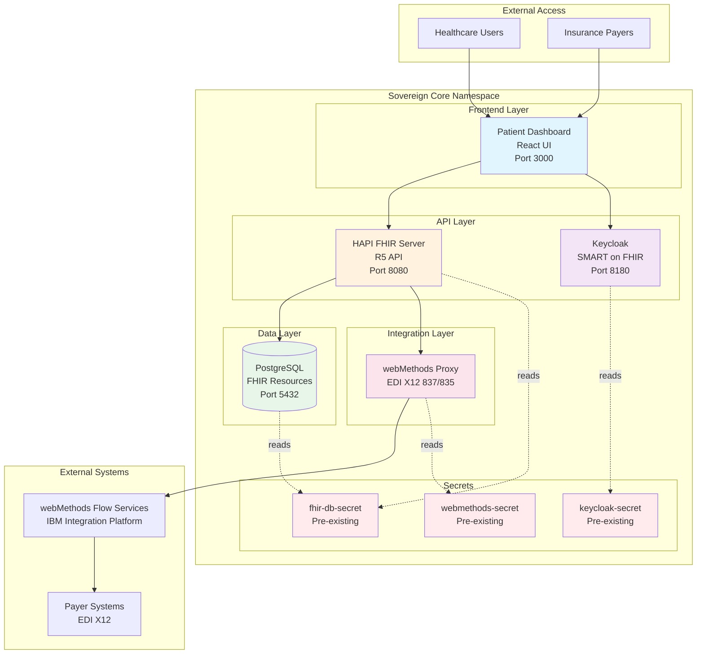
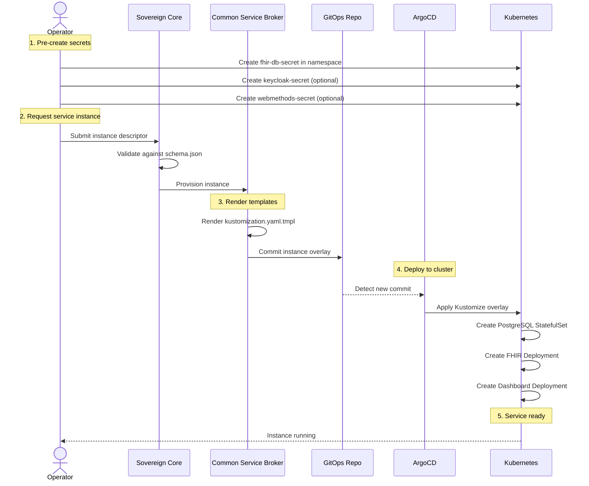

# sccat-fhir-healthcare — FHIR Healthcare Service

Complete HL7 FHIR R5 healthcare service with HAPI FHIR server, PostgreSQL database, patient dashboard, and webMethods EDI X12 integration for claims processing. Designed for IBM Sovereign Core catalog with **secretless deployment** using pre-existing secrets.

## Overview

This service provides a production-ready FHIR healthcare platform including:
- **HAPI FHIR Server** (R5) - Full HL7 FHIR API implementation
- **PostgreSQL Database** - Persistent storage for FHIR resources
- **Patient Dashboard** - React-based UI for patient and claims management
- **webMethods Integration** - EDI X12 837/835 claims processing
- **Keycloak Authentication** - SMART on FHIR OAuth2/OIDC (optional)

## Artifacts

### `manifests/`

| File | Kind | Purpose |
|------|------|---------|
| `kustomization.yaml` | Kustomization | Base resources entry point |
| `postgres-statefulset.yaml` | StatefulSet | PostgreSQL database with persistent storage |
| `postgres-service.yaml` | Service | PostgreSQL ClusterIP service |
| `fhir-deployment.yaml` | Deployment | HAPI FHIR server pods |
| `fhir-service.yaml` | Service | FHIR API ClusterIP service |
| `fhir-configmap.yaml` | ConfigMap | FHIR configuration (version, validation, narrative) |
| `dashboard-deployment.yaml` | Deployment | Patient dashboard frontend |
| `dashboard-service.yaml` | Service | Dashboard ClusterIP service |

### `catalog/`

| File | Purpose |
|------|---------|
| `catalog.yaml` | Service metadata with display name, description, and deployment plans (standard, minimal, secure, enterprise) |
| `schema.json` | JSON Schema for instance parameters: `namespace` (required), `fhir_secret_name` (required), `keycloak_secret_name`, `webmethods_secret_name`, resource limits, replicas, etc. |
| `metrics.json` | Metering configuration for usage tracking and billing integration |

### `template/`

| File | Purpose |
|------|---------|
| `kustomization.yaml.tmpl` | Jinja2 template for instance-specific overlays; patches names, replicas, storage, secret references, resource limits |

### Additional Files

| File | Purpose |
|------|---------|
| `imagesetconfiguration.yaml` | OpenShift Image Mirror configuration for air-gapped/disconnected deployments. Lists all 5 container images (HAPI FHIR, PostgreSQL, Keycloak, Dashboard, webMethods) for mirroring to sovereign registries. |
| `README.md` | This file - comprehensive service documentation |
| `RUNBOOK.md` | Operational procedures for Day 2 operations |
| `SBOM.md` | Software Bill of Materials with all dependencies |
| `METERING.md` | Metering integration documentation |

## Architecture



## Secret Strategy

**Pre-existing secrets (mariadbnsl pattern)** — All credentials must be pre-created in the instance namespace before provisioning. The broker never sees credential values.

### Required Secret Shapes

#### 1. FHIR Database Secret (`fhir_secret_name`)

```yaml
apiVersion: v1
kind: Secret
metadata:
  name: fhir-db-credentials  # matches spec.fhir_secret_name
  namespace: fhir-healthcare  # matches spec.namespace
type: Opaque
stringData:
  postgres-db: "fhirdb"
  postgres-user: "fhiruser"
  postgres-password: "secure-password-here"
```

#### 2. Keycloak Secret (`keycloak_secret_name`) - Optional

```yaml
apiVersion: v1
kind: Secret
metadata:
  name: keycloak-credentials
  namespace: fhir-healthcare
type: Opaque
stringData:
  admin-user: "admin"
  admin-password: "secure-password-here"
```

#### 3. webMethods Secret (`webmethods_secret_name`) - Optional

```yaml
apiVersion: v1
kind: Secret
metadata:
  name: webmethods-credentials
  namespace: fhir-healthcare
type: Opaque
stringData:
  api-key: "your-api-key-here"
  claim-endpoint: "https://prod121185.a-vir-r1.int.ipaas.automation.ibm.com/..."
  claimresponse-endpoint: "https://prod121185.a-vir-r1.int.ipaas.automation.ibm.com/..."
```

## Schema Parameters

### Required Parameters

| Parameter | Type | Description |
|-----------|------|-------------|
| `namespace` | string | Target Kubernetes namespace (operator-chosen, must pre-exist) |
| `fhir_secret_name` | string | Name of pre-existing secret for PostgreSQL credentials |

### Conditional Required Parameters

| Parameter | Type | Condition | Description |
|-----------|------|-----------|-------------|
| `keycloak_secret_name` | string | `enable_keycloak: true` | Keycloak admin credentials secret |
| `webmethods_secret_name` | string | `enable_webmethods: true` | webMethods API credentials secret |
| `ingress_host` | string | `ingress_enabled: true` | Hostname for ingress |

### Optional Parameters with Defaults

| Parameter | Type | Default | Description |
|-----------|------|---------|-------------|
| `fhir_version` | string | "R5" | FHIR specification version (R4 or R5) |
| `postgres_storage_size` | string | "20Gi" | PostgreSQL persistent volume size |
| `fhir_replicas` | integer | 1 | Number of FHIR server replicas |
| `dashboard_replicas` | integer | 2 | Number of dashboard replicas |
| `enable_keycloak` | boolean | true | Enable Keycloak authentication |
| `enable_webmethods` | boolean | true | Enable webMethods integration |
| `fhir_memory_limit` | string | "2Gi" | FHIR server memory limit |
| `fhir_cpu_limit` | string | "2" | FHIR server CPU limit |
| `postgres_memory_limit` | string | "1Gi" | PostgreSQL memory limit |
| `enable_validation` | boolean | true | Enable FHIR resource validation |
| `enable_narrative` | boolean | true | Enable narrative generation |
| `ingress_enabled` | boolean | false | Enable ingress for external access |

## Resource Requirements

### Default Resource Allocation

| Component | CPU Request | CPU Limit | Memory Request | Memory Limit | Storage |
|-----------|-------------|-----------|----------------|--------------|---------|
| PostgreSQL | 250m | 1 | 512Mi | 1Gi | 20Gi (PV) |
| HAPI FHIR | 500m | 2 | 1Gi | 2Gi | - |
| Dashboard | 100m | 500m | 256Mi | 512Mi | - |
| **Total** | **850m** | **3.5** | **1.75Gi** | **3.5Gi** | **20Gi** |

✅ **Catalogathon Compliant**: Well under 8 CPU and 100GB limits

## Example Instance Descriptor

```yaml
service_type: sccat-fhir-healthcare
environment: production
cluster_name: k3s-cluster-1
spec:
  # Required
  namespace: fhir-healthcare
  fhir_secret_name: fhir-db-credentials
  
  # Optional - Keycloak
  enable_keycloak: true
  keycloak_secret_name: keycloak-credentials
  
  # Optional - webMethods
  enable_webmethods: true
  webmethods_secret_name: webmethods-credentials
  
  # Optional - Configuration
  fhir_version: R5
  postgres_storage_size: 50Gi
  fhir_replicas: 2
  dashboard_replicas: 3
  
  # Optional - Resource Limits
  fhir_memory_limit: 4Gi
  fhir_cpu_limit: "4"
  postgres_memory_limit: 2Gi
  
  # Optional - Features
  enable_validation: true
  enable_narrative: true
  
  # Optional - Ingress
  ingress_enabled: true
  ingress_host: fhir.example.com
```

## Deployment Flow



## Features

### FHIR Capabilities
- ✅ Full HL7 FHIR R5 API implementation
- ✅ Patient, Practitioner, Organization resources
- ✅ Claim, ClaimResponse, Coverage resources
- ✅ CQL rules execution for claims validation
- ✅ FHIR resource validation
- ✅ Narrative generation
- ✅ Search parameters and filtering

### Claims Processing
- ✅ Claims submission and adjudication workflow
- ✅ webMethods EDI X12 837 (Professional Claims)
- ✅ webMethods EDI X12 835 (Payment/Remittance)
- ✅ Real-time claims validation with CQL
- ✅ Multi-agent workflow orchestration

### Authentication & Security
- ✅ Keycloak SMART on FHIR OAuth2/OIDC
- ✅ Role-based access control (Provider, Payer, Admin)
- ✅ Secretless deployment pattern
- ✅ No credentials in Git
- ✅ TLS/HTTPS ready

### Observability
- ✅ Health checks (readiness & liveness probes)
- ✅ Resource limits and requests
- ✅ Structured logging
- ✅ Metrics endpoints

## Testing

### Local Testing with kubectl

```bash
# Validate the base manifests
kubectl kustomize services/sccat-fhir-healthcare/v1/manifests

# Test with a sample instance (after rendering template)
kubectl kustomize instances-sample/test-fhir-instance/

# Apply to cluster
kubectl apply -k instances-sample/test-fhir-instance/
```

### Air-Gapped Deployment Testing

```bash
# Mirror images to disconnected registry
oc-mirror --config=services/sccat-fhir-healthcare/v1/imagesetconfiguration.yaml \
  docker://registry.example.com

# Apply ImageContentSourcePolicy
oc apply -f ./oc-mirror-workspace/results-*/imageContentSourcePolicy.yaml

# Update manifests to use mirrored registry
# Edit manifests to reference registry.example.com instead of quay.io
```

### Verify Deployment

```bash
# Check pods
kubectl get pods -n fhir-healthcare

# Check services
kubectl get svc -n fhir-healthcare

# Check FHIR server health
kubectl port-forward svc/test-fhir-instance-fhir 8080:8080 -n fhir-healthcare
curl http://localhost:8080/fhir/metadata

# Check dashboard
kubectl port-forward svc/test-fhir-instance-dashboard 3000:3000 -n fhir-healthcare
```

## Day 2 Operations

### Scaling

```bash
# Scale FHIR server
kubectl scale deployment test-fhir-instance-fhir --replicas=3 -n fhir-healthcare

# Scale dashboard
kubectl scale deployment test-fhir-instance-dashboard --replicas=5 -n fhir-healthcare
```

### Backup PostgreSQL

```bash
# Exec into postgres pod
kubectl exec -it test-fhir-instance-postgres-0 -n fhir-healthcare -- bash

# Create backup
pg_dump -U fhiruser fhirdb > /tmp/fhir-backup.sql
```

### Monitoring

```bash
# View logs
kubectl logs -f deployment/test-fhir-instance-fhir -n fhir-healthcare
kubectl logs -f statefulset/test-fhir-instance-postgres -n fhir-healthcare

# Check resource usage
kubectl top pods -n fhir-healthcare
```

## Troubleshooting

### Pod Not Starting

```bash
# Check pod status
kubectl describe pod <pod-name> -n fhir-healthcare

# Common issues:
# - Secret not found: Ensure fhir-db-secret exists in namespace
# - Image pull error: Check image availability
# - Resource limits: Verify cluster has sufficient resources
```

### Database Connection Issues

```bash
# Test PostgreSQL connectivity
kubectl exec -it test-fhir-instance-postgres-0 -n fhir-healthcare -- \
  psql -U fhiruser -d fhirdb -c "SELECT 1"

# Check secret values
kubectl get secret fhir-db-credentials -n fhir-healthcare -o yaml
```

### FHIR Server Not Responding

```bash
# Check FHIR server logs
kubectl logs deployment/test-fhir-instance-fhir -n fhir-healthcare --tail=100

# Test metadata endpoint
kubectl exec -it deployment/test-fhir-instance-fhir -n fhir-healthcare -- \
  curl http://localhost:8080/fhir/metadata
```

## Compliance & Security

### Sovereign Core Requirements

✅ **Air-gapped deployment** - No external dependencies, imagesetconfiguration.yaml for mirroring
✅ **Secretless** - No credentials in Git, pre-created secrets pattern
✅ **Resource constrained** - Under 8 CPU, 100GB limits (default: 3.5 CPU, 3.5Gi RAM, 20Gi storage)
✅ **Rootless containers** - All containers run as non-root users
✅ **Health checks** - Readiness and liveness probes on all components
✅ **SBOM included** - Software Bill of Materials with all dependencies
✅ **Image mirroring** - OpenShift ImageSetConfiguration for disconnected registries
✅ **Metering integration** - Usage tracking and billing support

### Security Best Practices

- Pre-create secrets before provisioning
- Use strong passwords (min 16 characters)
- Rotate credentials regularly (every 90 days)
- Enable TLS/HTTPS for production
- Use network policies for pod-to-pod communication
- Regular security scanning of container images

## Support

For issues or questions:
- Review this README and troubleshooting section
- Check pod logs and events
- Verify secret configuration
- Contact Sovereign Core support team

## License

IBM Proprietary - Sovereign Core Catalog Service

---

**Made with Bob** 🤖